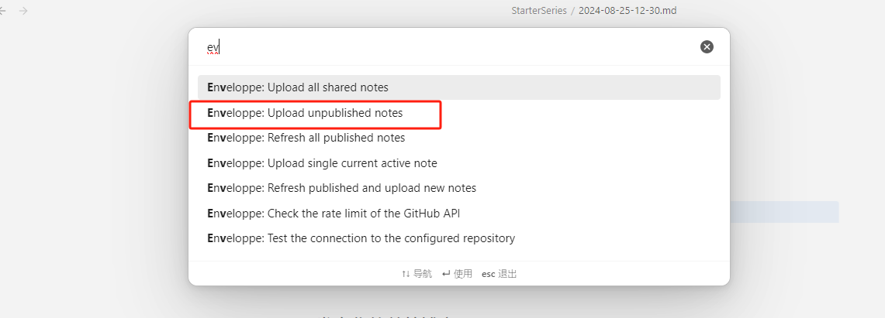

> [!前言]
> 随着接触的知识越来越多，大脑容量感觉严重不足，这个时候就考虑要构建自己的知识体系，尝试过博客园、语雀、知识库等诸多软件，经历过服务器宕机、文章丢失等情况，下定决心要构建自己的博客。
> 查询了诸多资料后，决定采用 **googleDrive + Obsidian + github pages** 框架，实现个人博客发布并保存源文件。
> 

### 基础组件

| 工具           | 备住                        |
| ------------ | ------------------------- |
| google drive | 备份源文件，其他云盘也可，需要自己研究       |
| Obsidian     | 写作应用程序,用于编写markdown格式blog |
| EnveLoppe    | Obsidian的插件，用于note的自动发布   |
| github pages | github托管站点，用于blog部署       |
| jekyll       | 社区模板，用于制作blog模板           |

### jekyll

Jekyll 是一个简单的博客形态的静态站点生产机器。它有一个模版目录，其中包含原始文本格式的文档，通过转换器（如[Markdown](http://daringfireball.net/projects/markdown/)）和渲染器（[Liquid](https://github.com/Shopify/liquid/wiki)）转化成一个完整的可发布的静态网站，你可以发布在任何你喜爱的服务器上。Jekyll 也可以运行在 [GitHub Page](http://pages.github.com/) 上，也就是说，你可以使用 GitHub 的服务来搭建你的项目页面、博客或者网站，而且是**完全免费**的。

有趣的是你可以在 [Jekyll Themes](http://jekyllthemes.org/) 找到许多模板，我使用的是 [portfolio](https://github.com/abhn/portfolio) ，看看实际效果如下：

依照[redme.md](https://github.com/abhn/portfolio/blob/add-license-1/README.md)部署并上传自己的github，需要注意的是仓库命名有严格的要求：***github_name***.github.io，例如我的仓库为 ==**HarrisJian.github.io**==，记得将文件中的信息替换为自己的信息。

到这一步为止，你已经可以通过 [https://harrisjian.github.io/](https://harrisjian.github.io/)访问到自己的主页了：

### github pages
[Github Pages](http://pages.github.com/) 是面向用户、组织和项目开放的公共静态页面搭建托管服 务，站点可以被免费托管在 Github 上，你可以选择使用 Github Pages 默 认提供的域名 [github.io](https://jekyllcn.com/docs/github-pages/) 或者自定义域名来发布站点。Github Pages 支持 自动利用 Jekyll 生成站点，也就是说通过上一步你已经完成了github pages的部署工作啦。

### Obsidian
[Obsidian](https://obsidian.md/)是一款强大且可扩展的知识库，它运行在本地纯文本文件夹之上。该应用程序支持Markdown，具有整洁的界面和方便的无干扰写作模式。主页面见下图：

主要就是用来编辑markdown格式的博客内容，本篇文章就是在这里完成的。
我们可以先部署模板，创建文件夹存储模板，可以参考我的配置：

注意要把模板的文件夹配置一下，后续可以通过插入模板快速创建文章元数据

要完成node的自动发布还需要用到一个插件：Enveloppe
### EnveLoppe
[Enveloppe](https://github.com/Enveloppe/obsidian-enveloppe) 是一个能够将指定文章推送到指定 GitHub 目录的插件。我们有两种方式安装该插件。

##### 安装Enveloppe
==**在线安装**== 需要使用科学上网工具，如图在Obsidian 的第三方查找并安装，注意要先**关闭安全模式**。

==**离线安装**== 不需要使用科学上网工具，在[Enveloppe](https://github.com/Enveloppe/obsidian-enveloppe) 下载插件，然后复制到Obsidian的插件库，重启Obsidian即可。

##### 配置Enveloppe
下列配置项配置仅作参考，根据自己的实际情况修改。

首先就是github config的配置，主要是配置用户名、仓库名、分支以及自己的TOKEN。

接下来需要配置的是上传的文件路径，我这里配置的是_posts

后续如果想要发布文章在文章属性中插入模板，勾选share为true，并将文件名改成时间格式即可。

### google drive
[google drive](https://drive.google.com/drive/)是一个安全可靠的文件存储平台，您可以在一个地方存储所有文件。您可以通过电脑、手机或平板等设备随时访问您的文件。通过Google Workspace集成，您可以很容易地邀请其他人对共享文件查看、编辑或留言。

这里我们使用[桌面版云端硬盘](https://www.google.com/drive/download/)，好处是可以直接映射本地文件夹到云端硬盘，结合我们将Obsidian工作目录也设置在同一位置，就可以做到在本地编辑博客内容，同步上传github、上传google dirve，实现双备份。

### 发布你的首篇博客吧
所有准备完毕，control + P用命令行publish即可。
